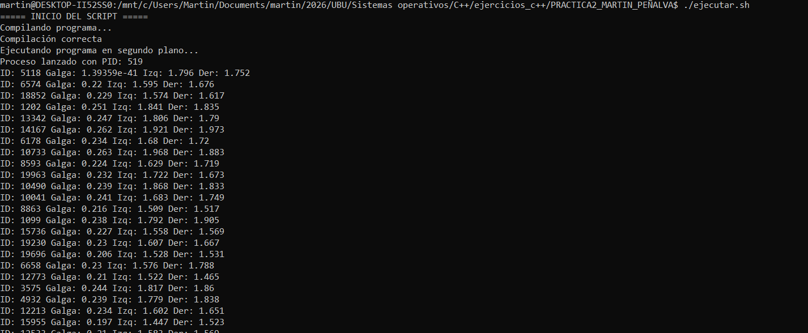
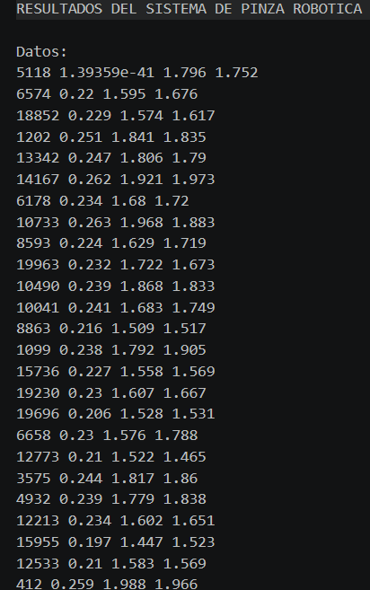
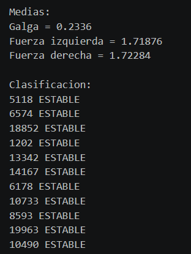

# Informe de la Práctica 2: Sistema de Pinza Robótica

## Portada

- Nombre: Martin Peñalva Artázcoz
- Titulación: Grado de Tecnologías Digitales para la Empresa
- Asignatura: Sistemas Operativos
- Práctica: 2


## 1. Funcionamiento del programa (pinza.cpp)
El programa desarrollado en C++ tiene como objetivo procesar y analizar datos de telemetría de una pinza robótica. Su funcionamiento se divide en las siguientes fases:

### 1.1 Lectura de datos
```cpp
ifstream archivo("datos_pinza.txt");

if (!archivo) {
    cout << "Error al abrir el archivo" << endl;
    return 1;
}

int ids[100];
float datos[100][3];
float galga[100];
float fuerza_izq[100];
float fuerza_der[100];

int n = 0;

// Lectura de datos
while (archivo >> ids[n] >> datos[n][0] >> datos[n][1] >> datos[n][2] && n < 100) {
    galga[n] = datos[n][0];
    fuerza_izq[n] = datos[n][1];
    fuerza_der[n] = datos[n][2];
    n++;
}

archivo.close();
```
Abre el archivo `datos_pinza.txt` y carga hasta 100 registros que incluyen el ID de la muestra, valor de la galga y fuerzas de las pinzas izquierda y derecha.

### 1.2 Procesamiento Estadístico
```cpp
// Cálculo de medias
float suma_galga = 0, suma_izq = 0, suma_der = 0;

for (int i = 0; i < n; i++) {
    suma_galga += galga[i];
    suma_izq += fuerza_izq[i];
    suma_der += fuerza_der[i];
}

float media_galga = suma_galga / n;
float media_izq = suma_izq / n;
float media_der = suma_der / n;
```
Calcula la media aritmética de cada una de las tres magnitudes medidas.

### 1.3 Análisis de Estabilidad
```cpp
// Evaluación de estabilidad
string estado[100];

for (int i = 0; i < n; i++) {
    float diferencia = fabs(fuerza_izq[i] - fuerza_der[i]);

    if (diferencia > 0.15)
        estado[i] = "INESTABLE";
    else
        estado[i] = "ESTABLE";

    cout << "Estado muestra " << ids[i] << ": " << estado[i] << endl;
}
```
Para cada muestra, calcula la diferencia absoluta entre la fuerza izquierda y derecha. Si la diferencia es superior a **0.15**, la muestra se clasifica como **INESTABLE**; de lo contrario, es **ESTABLE**.

### 1.4 Salida de Resultados
```cpp
// Escritura archivo salida
ofstream salida("resultado_pinza.txt");

salida << "RESULTADOS DEL SISTEMA DE PINZA ROBOTICA\n\n";

salida << "Datos:\n";
for (int i = 0; i < n; i++) {
    salida << ids[i] << " "
           << galga[i] << " "
           << fuerza_izq[i] << " "
           << fuerza_der[i] << endl;
}

salida << "\nMedias:\n";
salida << "Galga = " << media_galga << endl;
salida << "Fuerza izquierda = " << media_izq << endl;
salida << "Fuerza derecha = " << media_der << endl;

salida << "\nClasificacion:\n";
for (int i = 0; i < n; i++) {
    salida << ids[i] << " " << estado[i] << endl;
}

salida.close();
```
Genera el archivo `resultado_pinza.txt` con el resumen de los datos, las medias calculadas y la clasificación de estabilidad de cada toma.

## 2. Explicación del script en Bash (ejecutar.sh)
El script automatiza el ciclo de vida de la ejecución del programa:

### 2.1 Compilación
```bash
# 1. Compilar el programa
echo "Compilando programa..."
g++ pinza.cpp -o pinza

# Comprobar si la compilación fue correcta
if [ $? -ne 0 ]; then
    echo "Error en la compilación"
    exit 1
fi

echo "Compilación correcta"
```
Utiliza `g++` para compilar `pinza.cpp` y generar el ejecutable.

### 2.2 Ejecución en segundo plano
```bash
# 2. Ejecutar en segundo plano
echo "Ejecutando programa en segundo plano..."
./pinza &

PID=$!

echo "Proceso lanzado con PID: $PID"
```
Lanza el programa `./pinza &` para que se ejecute de forma asíncrona.

### 2.3 Control de procesos
```bash
# 3. Esperar a que termine
wait $PID

echo "Proceso finalizado (wait)"

# 4. Comprobar si sigue activo
if ps -p $PID > /dev/null
then
    echo "El proceso sigue activo. Finalizando..."
    
    # 5. Finalización controlada
    kill $PID
    
    echo "Proceso terminado manualmente"
else
    echo "El proceso ya terminó correctamente"
fi
```
Captura el PID del proceso lanzado y utiliza el comando `wait` para sincronizar la finalización del script con la del programa. Verifica si el proceso sigue activo y, en caso afirmativo, realiza una finalización controlada mediante el comando `kill`.

## 3. Capturas de pantalla de ejecución
Para documentar la ejecución correcta del sistema, se deben incluir las siguientes capturas:

1. **Ejecución del script en la terminal**: Captura que muestre la ejecución del comando `./ejecutar.sh`, incluyendo los mensajes de "Compilación correcta", el PID asignado al proceso en segundo plano y el mensaje final de "Proceso finalizado".
2. **Archivo de entrada (datos_pinza.txt)**: Captura de las primeras líneas del archivo de datos para verificar el formato de entrada.
3. **Archivo de resultados (resultado_pinza.txt)**: Captura del archivo generado donde se visualicen las medias calculadas y la clasificación de estabilidad (ESTABLE/INESTABLE).
4. **Código fuente en el IDE**: Captura del entorno de desarrollo mostrando el código de `pinza.cpp` y `ejecutar.sh`.

### Imágenes incluidas







## 4. Interpretación de resultados
Los resultados permiten identificar fallos en el agarre de la pinza robótica. Una clasificación de **INESTABLE** indica una asimetría en la fuerza aplicada que podría provocar la caída o el daño del objeto manipulado. Las medias proporcionan una visión global del comportamiento del sensor de la galga y la presión nominal del sistema.

## 5. Enlace al repositorio Git
[Repositorio del Proyecto - GitHub](https://github.com/martinPenalva/Practica2_Martin_Penalva.git)
